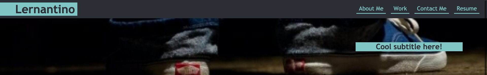
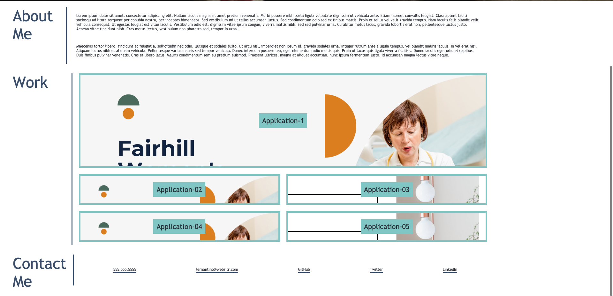

# professional-portfolio

[Professional Portfolio](https://sonali-pandey.github.io/professional-portfolio/)

* Loads the potemtial employee's Name, photo, and navigation links to sections about them, thier work and contact details.
* On clicking on the nav links the UI scrolls to the corresponding section.
* Work section shows all the projects of the employee and on clicking on the application names takes you to the deployed application.
* The UI has a rrsponsive layout and adopts to the different screen-sizes.

## Screens

### Made by: [Sonali Pandey](github.com/sonali-pandey)
